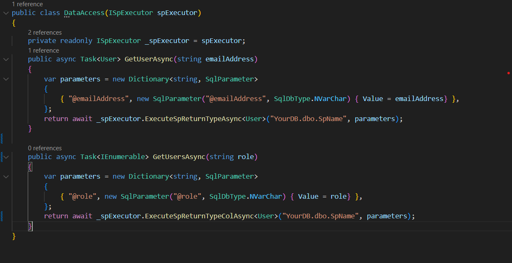

Step 1: Include the package

Step 2: Register services

Step 3 : Here you go

Available Methods :

    /// 

    /// Method executes the stored procedure and returns a rows modified count
    /// 

    /// <param name="storedProcName"></param>
    /// <param name="cancellationToken"></param>
    /// <returns></returns>
    Task<long> ExecuteSpAsync(string storedProcName, CancellationToken cancellationToken = default);

    /// 

    /// Method executes the stored procedure and returns a rows modified count
    /// 

    /// <param name="storedProcName"></param>
    /// <param name="procParameters"></param>
    /// <param name="cancellationToken"></param>
    /// <returns></returns>
    Task<long> ExecuteSpAsync(string storedProcName, Dictionary<string, SqlParameter> procParameters, CancellationToken cancellationToken = default);

    /// 

    /// Method executes the stored procedure and returns a dataset
    /// 

    /// <param name="storedProcName"></param>
    /// <param name="cancellationToken"></param>
    /// <returns></returns>
    Task<DataSet> ExecuteSpReturnDataSetAsync(string storedProcName, CancellationToken cancellationToken = default);

    /// 

    /// Method executes the stored procedure and returns a dataset
    /// 

    /// <param name="storedProcName"></param>
    /// <param name="procParameters"></param>
    /// <param name="cancellationToken"></param>
    /// <returns></returns>
    Task<DataSet> ExecuteSpReturnDataSetAsync(string storedProcName, Dictionary<string, SqlParameter> procParameters, CancellationToken cancellationToken = default);

    /// 

    /// Method executes the stored procedure and returns a same type which has been passed
    /// 

    /// <typeparam name="T"></typeparam>
    /// <param name="storedProcName"></param>
    /// <param name="cancellationToken"></param>
    /// <returns></returns>
    Task<T> ExecuteSpReturnTypeAsync<T>(string storedProcName, CancellationToken cancellationToken = default) where T : class, new();

    /// 

    /// Method executes the stored procedure and returns a same type which has been passed
    /// 

    /// <typeparam name="T"></typeparam>
    /// <param name="storedProcName"></param>
    /// <param name="procParameters"></param>
    /// <param name="cancellationToken"></param>
    /// <returns></returns>
    Task<T> ExecuteSpReturnTypeAsync<T>(string storedProcName, Dictionary<string, SqlParameter> procParameters, CancellationToken cancellationToken = default) where T : class, new();

    /// 

    /// Method executes the stored procedure and returns a same list type
    /// 

    /// <typeparam name="T"></typeparam>
    /// <param name="storedProcName"></param>
    /// <param name="cancellationToken"></param>
    /// <returns></returns>
    Task<List<T>> ExecuteSpReturnListTypeAsync<T>(string storedProcName, CancellationToken cancellationToken = default) where T : class, new();

    /// 

    /// Method executes the stored procedure and returns a same list type
    /// 

    /// <typeparam name="T"></typeparam>
    /// <param name="storedProcName"></param>
    /// <param name="procParameters"></param>
    /// <param name="cancellationToken"></param>
    /// <returns></returns>
    Task<List<T>> ExecuteSpReturnListTypeAsync<T>(string storedProcName, Dictionary<string, SqlParameter> procParameters, CancellationToken cancellationToken = default) where T : class, new();

    /// 

    /// Method executes the stored procedure and returns a dataTable
    /// 

    /// <param name="storedProcName"></param>
    /// <param name="cancellationToken"></param>
    /// <returns></returns>
    Task<DataTable> ExecuteSpReturnDataTableAsync(string storedProcName, CancellationToken cancellationToken = default);

    /// 

    /// Method executes the stored procedure and returns a dataTable
    /// 

    /// <param name="storedProcName"></param>
    /// <param name="procParameters"></param>
    /// <param name="cancellationToken"></param>
    /// <returns></returns>
    Task<DataTable> ExecuteSpReturnDataTableAsync(string storedProcName, Dictionary<string, SqlParameter> procParameters, CancellationToken cancellationToken = default);
