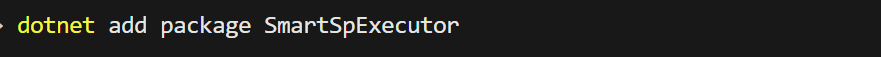
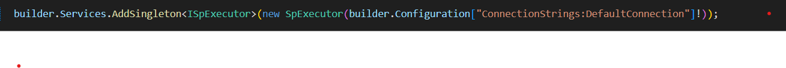
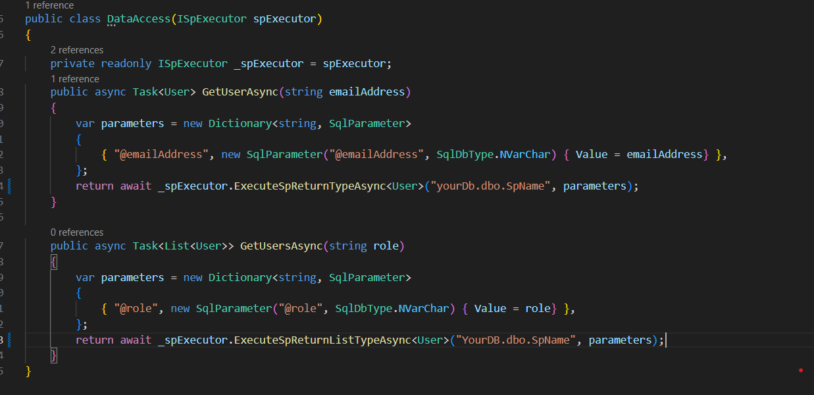

Step 1: Include the package

Step 2: Register services

Step 3 : Here you go

Available Methods :

///`
`

    /// Method executes the stored procedure and returns a rows modified count

    ///`
`

    ///<paramname="storedProcName">`</param>`

    ///<paramname="cancellationToken">`</param>`

    ///`<returns></returns>`

    Task`<long>` ExcuteSpAsync(stringstoredProcName, CancellationTokencancellationToken=default);

    ///`
`

    /// Method executes the stored procedure and returns a rows modified count

    ///`
`

    ///<paramname="storedProcName">`</param>`

    ///<paramname="procParameters">`</param>`

    ///<paramname="cancellationToken">`</param>`

    ///`<returns></returns>`

    Task`<long>` ExcuteSpAsync(stringstoredProcName, Dictionary<string, SqlParameter> procParameters, CancellationTokencancellationToken=default);

    ///`
`

    /// Method executes the stored procedure and returns a dataset

    ///`
`

    ///<paramname="storedProcName">`</param>`

    ///<paramname="cancellationToken">`</param>`

    ///`<returns></returns>`

    Task`<DataSet>` ExcuteSpReturnDataSetAsync(stringstoredProcName, CancellationTokencancellationToken=default);

    ///`
`

    /// Method executes the stored procedure and returns a dataset

    ///`
`

    ///<paramname="storedProcName">`</param>`

    ///<paramname="procParameters">`</param>`

    ///<paramname="cancellationToken">`</param>`

    ///`<returns></returns>`

    Task`<DataSet>` ExcuteSpReturnDataSetAsync(stringstoredProcName, Dictionary<string, SqlParameter> procParameters, CancellationTokencancellationToken=default);

    ///`
`

    /// Method executes the stored procedure and returns a same type which has been passed

    ///`
`

    ///<typeparamname="T">`</typeparam>`

    ///<paramname="storedProcName">`</param>`

    ///<paramname="cancellationToken">`</param>`

    ///`<returns></returns>`

    Task`<T>` ExecuteSpReturnTypeAsync `<T>`(stringstoredProcName, CancellationTokencancellationToken=default) whereT : class, new();

    ///`
`

    /// Method executes the stored procedure and returns a same type which has been passed

    ///`
`

    ///<typeparamname="T">`</typeparam>`

    ///<paramname="storedProcName">`</param>`

    ///<paramname="procParameters">`</param>`

    ///<paramname="cancellationToken">`</param>`

    ///`<returns></returns>`

    Task`<T>` ExecuteSpReturnTypeAsync `<T>`(stringstoredProcName, Dictionary<string, SqlParameter> procParameters, CancellationTokencancellationToken=default) whereT : class, new();

    ///`
`

    /// Method executes the stored procedure and returns a same list type

    ///`
`

    ///<typeparamname="T">`</typeparam>`

    ///<paramname="storedProcName">`</param>`

    ///<paramname="cancellationToken">`</param>`

    ///`<returns></returns>`

    Task<List`<T>`> ExecuteSpReturnListTypeAsync `<T>`(stringstoredProcName, CancellationTokencancellationToken=default) whereT : class, new();

    ///`
`

    /// Method executes the stored procedure and returns a same list type

    ///`
`

    ///<typeparamname="T">`</typeparam>`

    ///<paramname="storedProcName">`</param>`

    ///<paramname="procParameters">`</param>`

    ///<paramname="cancellationToken">`</param>`

    ///`<returns></returns>`

    Task<List`<T>`> ExecuteSpReturnListTypeAsync `<T>`(stringstoredProcName, Dictionary<string, SqlParameter> procParameters, CancellationTokencancellationToken=default) whereT : class, new();
